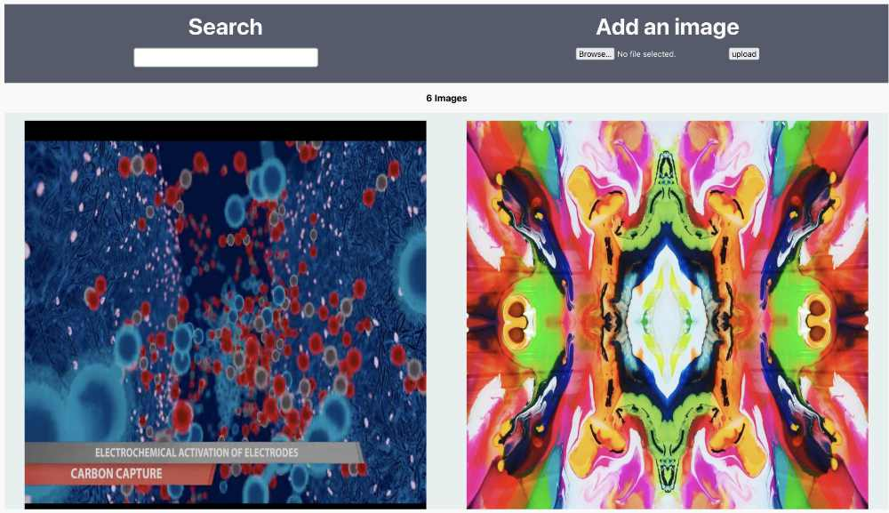
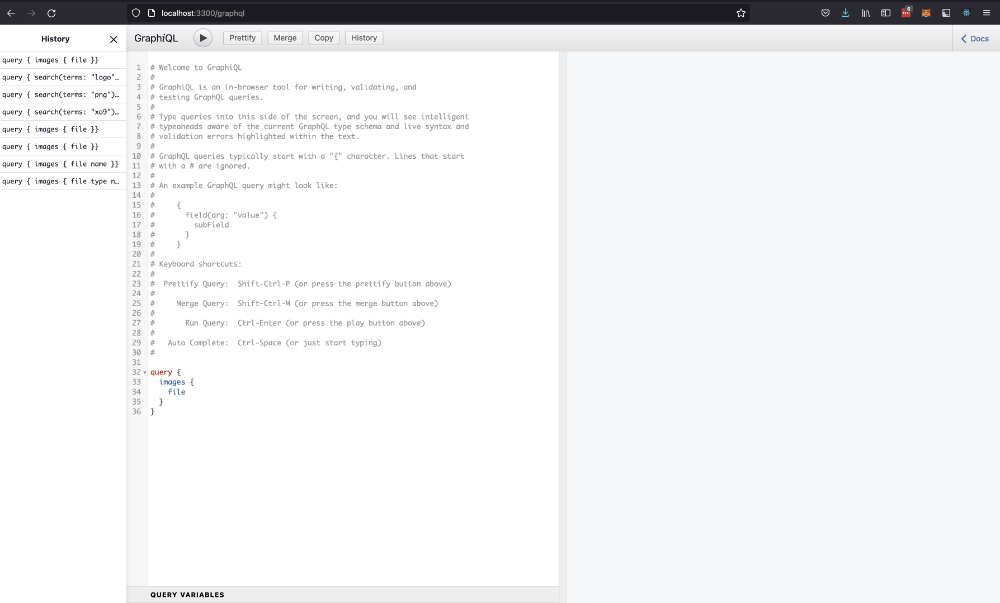

# image-uploader

Monorepo containing a React.js client and an Express.js GraphQL backend


## Getting Started

After cloning down the repo, you'll notice both client and server folders. We will start with setting up the client. You will need to have Node.js installed (v14+ recommended). This repo is also using postgres as a data store, so you'll need to make sure you've got pg installed and have access to its helper functions via a CLI. To create your database table run the following.

```
createdb image-uploader
# if you need to nuke the db run: dropdb image-uploader
```

## Client



The client is using Create React App for a simple setup. If you are familiar with react-scripts then this will be very straightforward. Note, you will need the backend running for the client to work properly.

```
cd client
npm i
npm run start
```

This will start your development server on localhost:3000 by default. You should be able to see your application live in a web browser window.

## Server



The express server by default is set to run on localhost:3300. Accessing that URL via a browser should redirect you to localhost:3300/graphql, where you will see the interactive graphql playground. Here you can explore the schema, and available queries and mutations. 

To start the server run the following from the command line.

```
cd server
npm i
npm run dev
```

### Note on Images 

Images are being stored in the db as encoded base64 strings. This is a space overhead of approx 1/3 larger than a comparative BLOB. Due to the limited number of items used for this demo, the tradeoff for simplicity won over the need for space optimization. In production systems with millions of photos should investigate saving images as a BLOB or similar data format to reduce image size if needed. 


### Technologies

* React
* Node
* Express
* Graphql
* Apollo
* PostgresQL
* Sequelize
